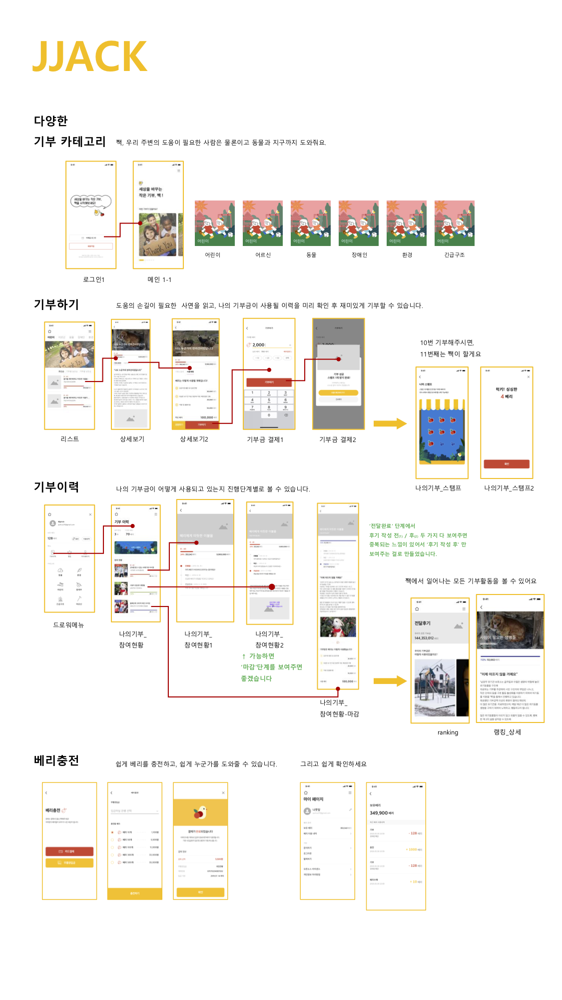

***JJack Service - JJack iOS***

프로젝트 이름
==========
### **JJack짹, 소액 기부 서비스 플랫폼**

 
 

## 서비스 워크 플로우 

## 시현 영상

## 개발 환경

- Xcode12
- Swift 4
- Alamofire
- Kingfisher
- SideMenu
- Lottie

## 기능

#### 로그인
- [x] 회원가입
- [x] 로그인

#### 홈
- [x] 기부 카테고리 표시 6개
- [x] 카테고리 상세 화면 / 리스트, 필터링
- [x] 수혜자 상세화면 / 기부 스토리, 사용계획, 응원하기
- [x] 기부하기 / 보유 베리 표시, 베리충전, 기부완료

#### 마이페이지
- [x] 프로필 / 닉네임, 이메일, 로그아웃, 프로필관리
- [x] 베리 이용 내역
- [x] 보유베리
- [ ] 짹 앱 버전
- [ ] 개인 처리 보호 방침
- [ ] 오픈 소스 라이센스
- [ ] 문의하기

#### 기부후기
- [x] 총 기부 베리 표시
- [x] 분야별 랭킹 -> 기부 후기 10개 표시로 변경 
- [x] 후기 / 상세화면

#### 기부 이력
- [x] 베리 / 기부한 베리, 기부 횟수 표시
- [x] 참여현황 / 기부 완료 상세 화면
- [x] 나의 스탬프 / 베리 수확 화면, 수확한 베리 확인
- [x] 수확 가능한 횟수 -> 스탬프 10개시 바로 수확으로 변경

#### 드로워
- [x] 홈버튼
- [x] 보유베리 / 충전, 이용 내역
- [x] 메뉴 / 기부 이력, 랭킹 -> 기부후기, 마이페이지
- [x] 카테고리 / 동물, 환경, 어린이, 장애우, 긴급구조, 어르신

## 저자

- **모상일** - [sangil](https://github.com/MoSangIl)
- [JJACK Team](https://github.com/JJACK-JJACK) :D

